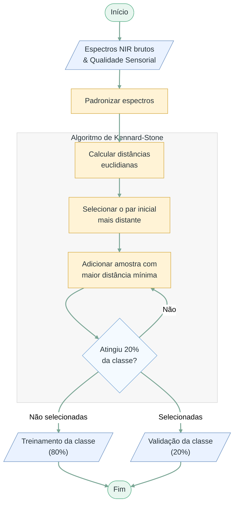
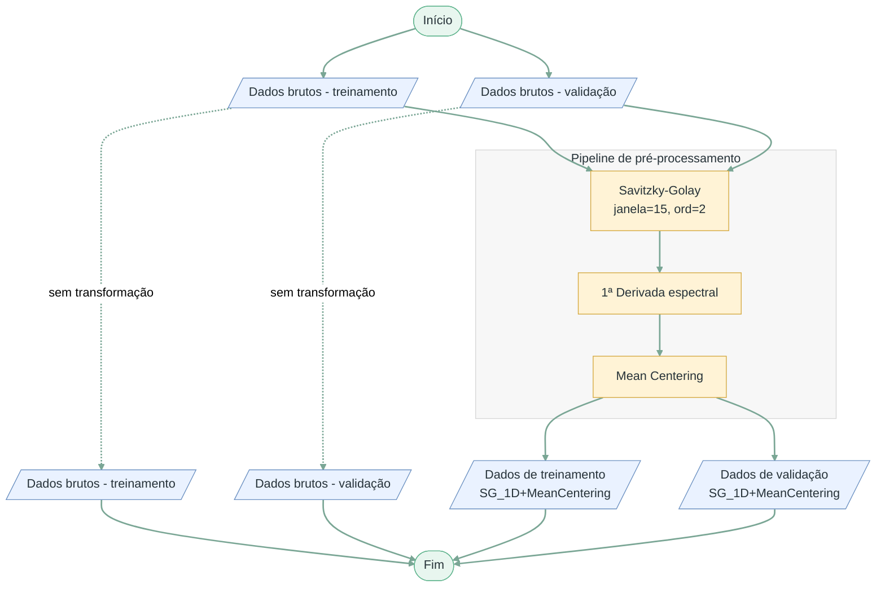
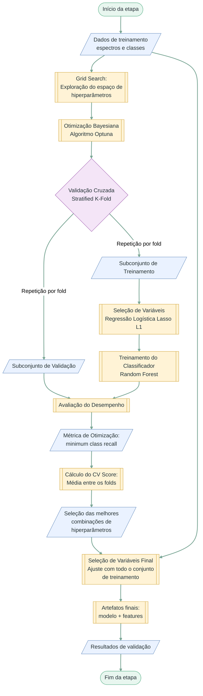
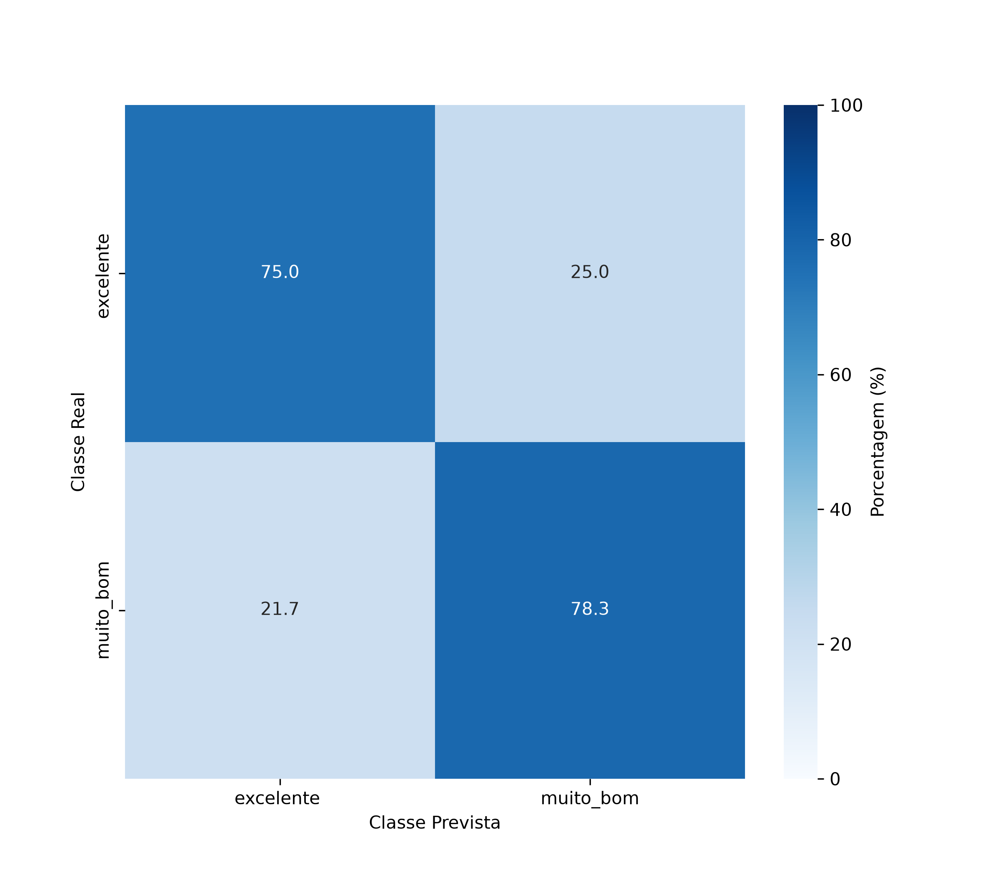

# Classificação de Cafés Especiais com NIR e Random Forest

Pipeline desenvolvida para o TCC **Classificação de Cafés Especiais da Região de Huila, Colômbia, por Espectroscopia NIR Utilizando Algoritmo Random Forest**.

O projeto classifica amostras de café torrado e moído nas classes sensoriais `muito_bom` e `excelente` a partir de espectros FT-NIR. A implementação reúne divisão representativa dos dados, pré-processamento espectral, seleção de variáveis, otimização de Random Forest e validação em um conjunto reservado.

## Visão geral da pipeline


A execução é coordenada por `main.py` e percorre cinco etapas: divisão dos dados, pré-processamento, visualização, busca bayesiana e validação final.

## Dados versionados

Os arquivos de entrada estão em `data/`:

| Arquivo | Conteúdo |
|---|---|
| `data/RawSpectra_RoastedCoffee.xlsx` | 192 espectros e 2.001 variáveis espectrais; aba `RawSpectra_RoastedCoffee` |
| `data/SensoryQuality_RoastedCoffee.xlsx` | Identificadores, notas e classes sensoriais; aba `Cup quality_RoastedCoffee` |

Os dados derivam dos dois arquivos de café torrado do conjunto *Fourier Transform Near Infrared (FT-NIR) spectra and sensory scores in green and roasted specialty coffee for machine learning-based quality monitoring*, versão 3, de Gentil Andres Collazos-Escobar, Ever M. Morales-Angulo, Andrés Felipe Bahamón Monje e Nelson Gutierrez Guzman ([Mendeley Data, DOI 10.17632/nz2fr76trm.3](https://doi.org/10.17632/nz2fr76trm.3)). O conjunto é distribuído sob a licença [CC BY 4.0](https://creativecommons.org/licenses/by/4.0/); consulte também o [artigo de dados associado](https://doi.org/10.1016/j.dib.2025.111609).

Para adequação à pipeline, os cabeçalhos espectrais foram consolidados, os identificadores de amostra e réplica foram combinados no formato `amostra_réplica`, os registros sensoriais foram reorganizados e a coluna `Class` foi derivada da nota: `excelente` para valores maiores ou iguais a 85 e `muito_bom` para os demais. Os valores de absorbância e as pontuações sensoriais foram preservados. Normalização de rótulos e conversão do eixo espectral ocorrem durante a execução, sem sobrescrever os XLSX versionados.

A pipeline utiliza a coluna `Class` como variável resposta. Quando o eixo espectral está em número de onda, ele é convertido para comprimento de onda, cobrindo aproximadamente 833 a 2.500 nm.

> **Nota de reprodutibilidade:** a planilha versionada contém 114 espectros `muito_bom` e 78 `excelente`. O texto e a Tabela 1 do TCC informam 111 e 81, respectivamente. A divisão e as métricas arquivadas correspondem aos dados versionados: 153 espectros de treinamento e 39 de validação, enquanto o texto do TCC informa 154 e 38.

## Partes principais

### 1. Divisão em treinamento e validação



O algoritmo Kennard–Stone seleciona aproximadamente 20% dos espectros de cada classe para validação. A seleção procura cobrir a variabilidade espectral da classe, enquanto as amostras restantes formam o conjunto de treinamento.

### 2. Pré-processamento e visualização



O tratamento `SG_1D+MeanCentering` aplica Savitzky-Golay com janela 15, polinômio de grau 2 e primeira derivada, seguido de centralização pela média. Treinamento e validação são processados separadamente, e as versões brutas são preservadas para comparação.

A visualização gera quatro gráficos: espectros brutos e pré-processados, coloridos por pontuação sensorial e por classe.

### 3. Seleção de variáveis e otimização



A regressão logística com penalização L1 seleciona os comprimentos de onda dentro de cada *fold*. Em seguida, o Random Forest é avaliado por validação cruzada estratificada, usando como objetivo o menor *recall* entre as classes. Uma execução materializa os folds uma única vez e os reutiliza em todas as tentativas, tanto nos espectros brutos quanto em `SG_1D+MeanCentering`, permitindo comparar os `cv_score` sob as mesmas partições.

O Grid Search mostrado no fluxograma foi uma etapa preliminar do TCC. Ele não é reexecutado por `main.py`, pois o texto informa apenas os limites e não os valores discretos da grade. A execução principal utiliza Optuna com o amostrador TPE nos intervalos refinados.

### 4. Validação final

As dez melhores combinações da busca conjunta são reajustadas com todo o conjunto de treinamento. Os quatro modelos com maior `cv_score` são aplicados ao conjunto reservado correspondente à sua versão espectral.

São calculadas acurácia, precisão, *recall*, especificidade e métricas balanceadas, globalmente e por classe. As matrizes de confusão são normalizadas pela classe real.

## Recipe do TCC

O repositório mantém uma única configuração executável: [`recipes/tcc.yaml`](recipes/tcc.yaml).

| Parâmetro | Configuração |
|---|---|
| Tentativas | 1.000 para cada versão espectral |
| Validação cruzada | 5 folds, estratificada e embaralhada |
| Função objetivo | maximizar `min_class_recall` |
| `n_estimators` | 350–450, passo 50 |
| `max_depth` | 14–15, passo 1 |
| `min_samples_split` | 10–19, passo 1 |
| `min_samples_leaf` | 1–2, passo 1 |
| `max_features` | 0,20–0,35, uniforme |
| `bootstrap` | `true` ou `false` |
| Modelos finais | 10 |
| Modelos na validação reservada | 4, selecionados por `cv_score` |

O TCC não informa numericamente a quantidade de tentativas, o número de folds, `C`, limiar, tolerância ou iterações do LASSO. Esses valores estão identificados no YAML como *defaults* operacionais históricos, e não como valores extraídos do texto.

## Instalação

Requer Python 3.12. Na raiz do repositório:

```bash
python3 -m venv venv
source venv/bin/activate
python -m pip install --upgrade pip
python -m pip install -r requirements.txt
```

No Windows PowerShell, ative o ambiente com `venv\Scripts\Activate.ps1`.

## Como executar

Execute a pipeline completa a partir da raiz:

```bash
python main.py \
  --spectra-file data/RawSpectra_RoastedCoffee.xlsx \
  --quality-file data/SensoryQuality_RoastedCoffee.xlsx \
  --recipe recipes/tcc.yaml
```

A recipe executa 2.000 tentativas no total — 1.000 para dados brutos e 1.000 para dados pré-processados — com cinco folds por tentativa. O tempo de execução depende do processador e pode ser elevado.

Uma chamada de `main.py` produz uma execução. O TCC utilizou cinco execuções sem *seed*; para repeti-las, execute o comando cinco vezes e preserve as saídas antes da chamada seguinte, pois os caminhos da raiz são reutilizados.

## Saídas de uma execução

| Caminho | Conteúdo |
|---|---|
| `data/raw_split/` | Espectros e classes de treinamento/validação |
| `data/processed/` | Espectros `SG_1D+MeanCentering` |
| `data/lasso_features_*.xlsx` | Máscaras de comprimentos de onda do LASSO reajustado em todo o treino para cada versão espectral |
| `plots/` | Gráficos dos espectros |
| `models/` | Dez pipelines treinadas em formato `.joblib` |
| `resultados_bayesian_search_treinamento.csv` | Ranking por validação cruzada e métricas de treinamento |
| `resultados_validacao_final.csv` | Métricas dos quatro modelos no conjunto reservado, preservando `cv_rank`, `cv_score` e ranking final |
| `confusion_matrices/` | Quatro matrizes de confusão normalizadas |

## Resultados apresentados no TCC

O recorte versionado está em [`resultados_tcc/`](resultados_tcc/):

- `rep_01/` a `rep_05/`: CSVs de treinamento e validação e planilhas de seleção LASSO;
- `figuras/`: Figuras 6–9 e 11 apresentadas no TCC;
- modelos `.joblib`, espectros intermediários e arquivos duplicados não são versionados.

O melhor modelo apresentado foi obtido na segunda repetição e alcançou:

| Acurácia | Precisão | Recall | Especificidade | Balanced accuracy |
|---:|---:|---:|---:|---:|
| 0,769 | 0,772 | 0,769 | 0,766 | 0,766 |



### Proveniência dos snapshots

Os arquivos em `resultados_tcc/` preservam as execuções históricas usadas nas tabelas e figuras. Nelas, foram armazenados 50 candidatos por repetição e a Tabela 5 foi formada pelos quatro primeiros do ranking no conjunto reservado. A recipe atualmente versionada segue o procedimento escrito nas Seções 4.5 e 4.6: dez modelos finais e escolha dos quatro por `cv_score`. Por isso, uma nova execução não reproduzirá esses snapshots byte a byte.

Os fontes Mermaid dos quatro fluxogramas também estão isolados em [`docs/fluxogramas/`](docs/fluxogramas/).
