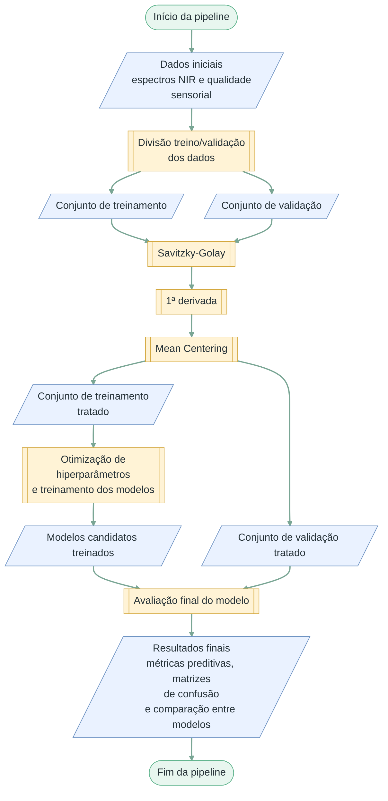
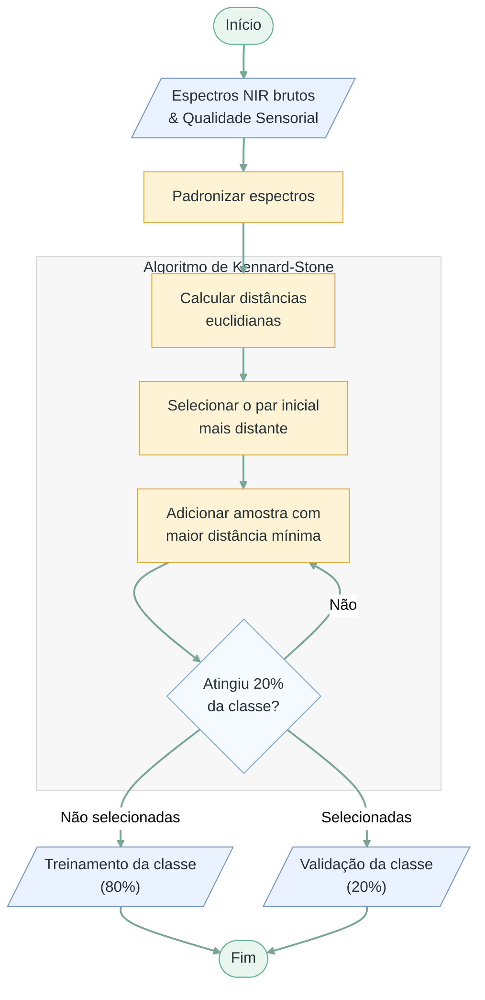
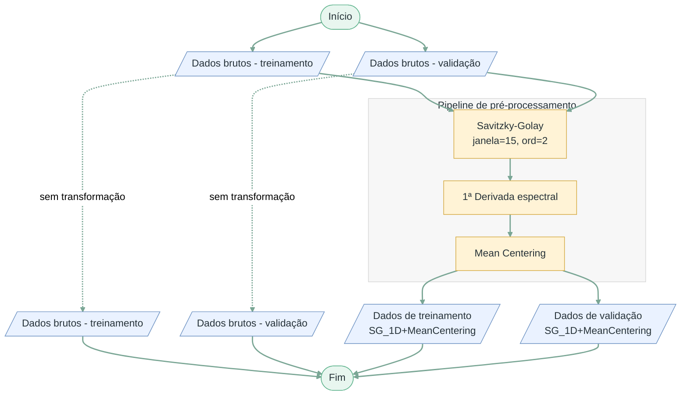
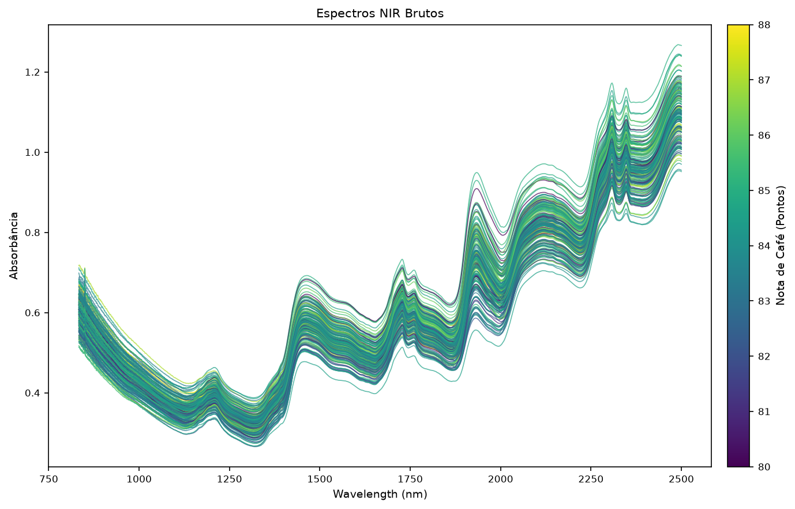
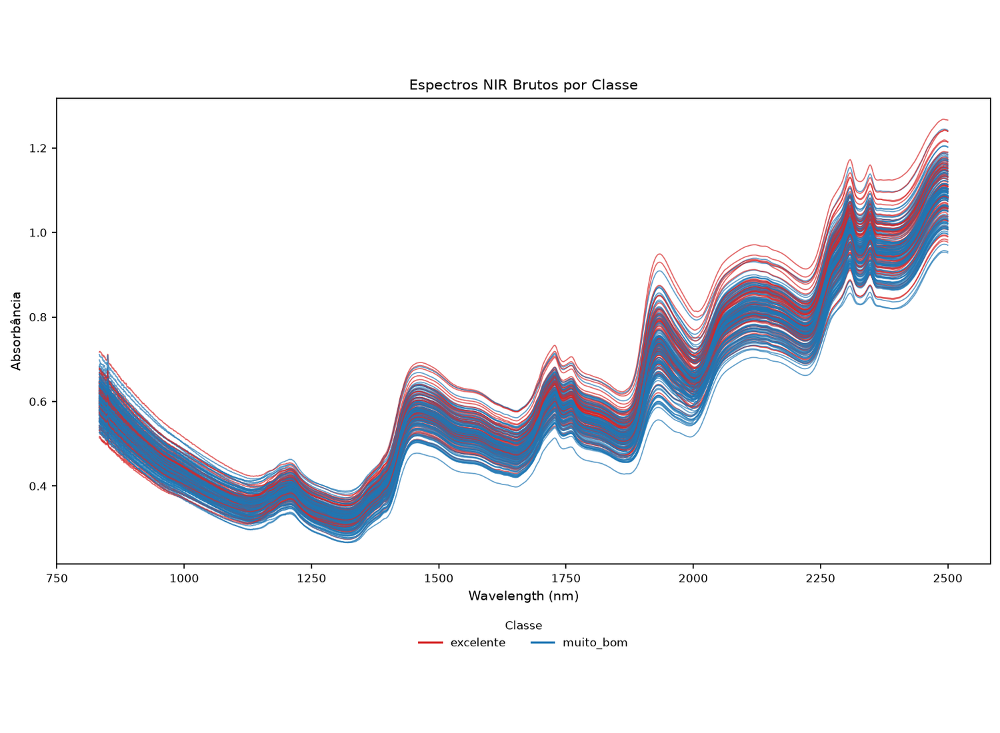
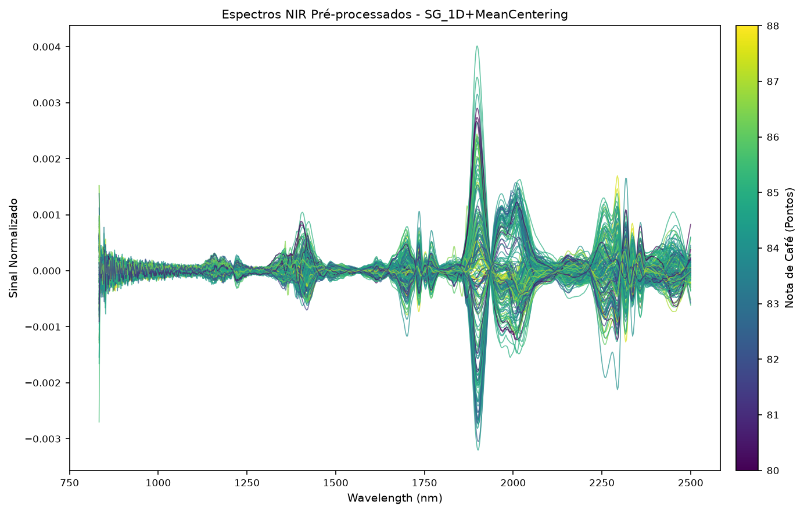
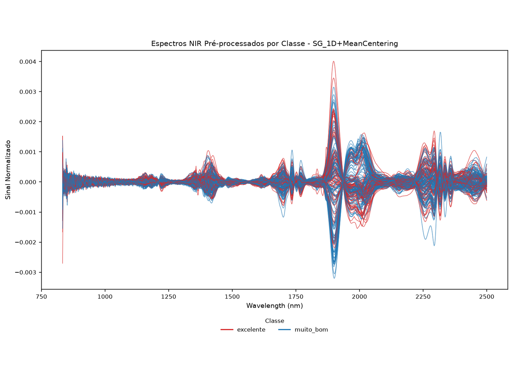
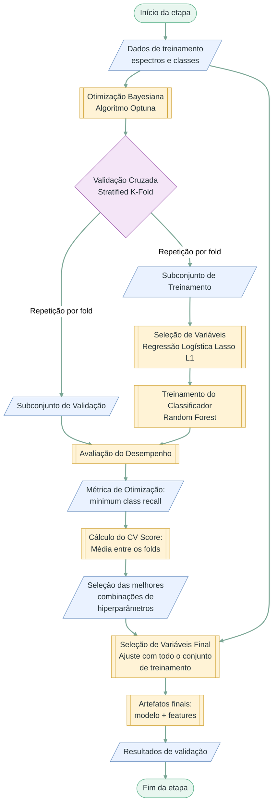
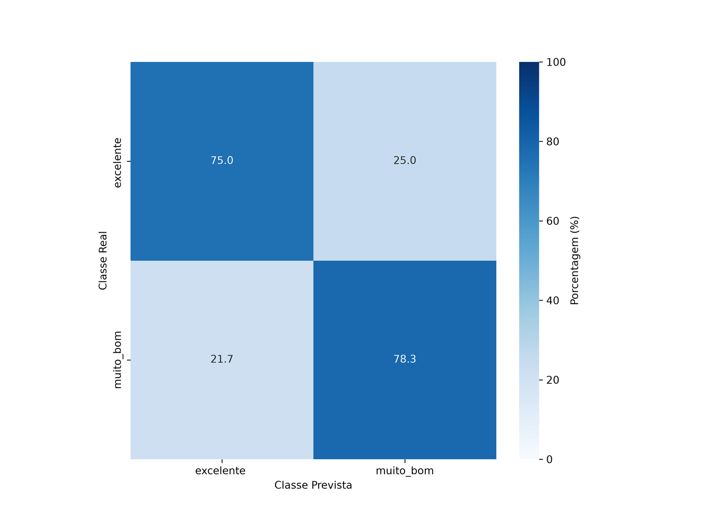

# Classificação de Cafés Especiais com NIR e Random Forest

Pipeline desenvolvida para o TCC **Classificação de Cafés Especiais da Região de Huila, Colômbia, por Espectroscopia NIR Utilizando Algoritmo Random Forest**.

O projeto classifica amostras de café torrado e moído nas classes sensoriais `muito_bom` e `excelente` a partir de espectros FT-NIR.

## Execução rápida

O projeto usa Python 3.12 e [`uv`](https://docs.astral.sh/uv/getting-started/installation/).

```bash
git clone https://github.com/A-malta/coffee-nir-quality.git
cd coffee-nir-quality
uv sync --locked
```

```bash
uv run --locked python main.py --spectra-file data/RawSpectra_RoastedCoffee.xlsx --quality-file data/SensoryQuality_RoastedCoffee.xlsx --recipe recipes/01.yaml
```

## Visão geral da pipeline

<div align="center">



</div>

## Estrutura do repositório

```text
.
├── data/
│   ├── RawSpectra_RoastedCoffee.xlsx
│   └── SensoryQuality_RoastedCoffee.xlsx
├── docs/
│   ├── 00_pipeline_geral.md
│   ├── 01_divisao_dados.md
│   ├── 02_preprocessamento.md
│   ├── 03_otimizacao.md
│   ├── figura-06_espectros_nir_brutos.png
│   ├── figura-07_espectros_nir_brutos_por_classe.png
│   ├── figura-08_espectros_nir_preprocessados.png
│   ├── figura-09_espectros_nir_preprocessados_por_classe.png
│   └── figura-11_matriz_confusao_melhor_modelo.png
├── recipes/
│   └── 01.yaml
├── scripts/
│   ├── __init__.py
│   ├── filter_results.py
│   ├── plot.py
│   ├── run_bayesian_search.py
│   ├── run_preprocessing.py
│   └── run_validation.py
├── src/
│   ├── data/
│   │   ├── __init__.py
│   │   ├── dataset.py
│   │   ├── kennard_stone.py
│   │   └── splitter.py
│   ├── evaluation/
│   │   ├── __init__.py
│   │   └── metrics.py
│   ├── modeling/
│   │   ├── __init__.py
│   │   └── feature_selection.py
│   ├── preprocessing/
│   │   ├── __init__.py
│   │   └── spectra.py
│   ├── __init__.py
│   └── config.py
├── .gitignore
├── .python-version
├── README.md
├── main.py
├── pyproject.toml
└── uv.lock
```

## Dados versionados

| Arquivo | Conteúdo |
|---|---|
| `data/RawSpectra_RoastedCoffee.xlsx` | 192 espectros e 2.001 variáveis espectrais; aba `RawSpectra_RoastedCoffee` |
| `data/SensoryQuality_RoastedCoffee.xlsx` | Identificadores, notas e classes sensoriais; aba `Cup quality_RoastedCoffee` |

Os dados derivam do conjunto *Fourier Transform Near Infrared (FT-NIR) spectra and sensory scores in green and roasted specialty coffee for machine learning-based quality monitoring*, versão 3, de Gentil Andres Collazos-Escobar, Ever M. Morales-Angulo, Andrés Felipe Bahamón Monje e Nelson Gutierrez Guzman ([Mendeley Data, DOI 10.17632/nz2fr76trm.3](https://doi.org/10.17632/nz2fr76trm.3)). O conjunto é distribuído sob a licença [CC BY 4.0](https://creativecommons.org/licenses/by/4.0/).

## Partes principais

### 1. Divisão em treinamento e validação

<div align="center">



</div>

### 2. Pré-processamento e visualização

<div align="center">



</div>

<table width="100%">
  <tr>
    <th width="50%">Espectros brutos por pontuação sensorial</th>
    <th width="50%">Espectros brutos por classe</th>
  </tr>
  <tr>
    <td align="center" valign="top"></td>
    <td align="center" valign="top"></td>
  </tr>
  <tr>
    <th width="50%">Espectros pré-processados por pontuação sensorial</th>
    <th width="50%">Espectros pré-processados por classe</th>
  </tr>
  <tr>
    <td align="center" valign="top"></td>
    <td align="center" valign="top"></td>
  </tr>
</table>

### 3. Seleção de variáveis e otimização

<div align="center">



</div>

## Recipe

| Parâmetro | Configuração |
|---|---|
| Tentativas | 1.000 para cada versão espectral |
| Validação cruzada | 5 folds, estratificada e embaralhada |
| Função objetivo | maximizar `min_class_recall` |
| `n_estimators` | 350–450, passo 50 |
| `max_depth` | 14–15, passo 1 |
| `min_samples_split` | 10–19, passo 1 |
| `min_samples_leaf` | 1–2, passo 1 |
| `max_features` | 0,20–0,35, uniforme |
| `bootstrap` | `true` ou `false` |
| Modelos finais | 10 |
| Modelos na validação reservada | 4, selecionados por `cv_score` |

## Saídas de uma execução

| Caminho |
|---|
| `data/raw_split/` |
| `data/processed/` |
| `data/lasso_features_*.xlsx` |
| `plots/` |
| `models/` |
| `resultados_bayesian_search_treinamento.csv` |
| `resultados_validacao_final.csv` |
| `confusion_matrices/` |

## Resultado de referência

| Acurácia | Precisão | Recall | Especificidade | Balanced accuracy |
|---:|---:|---:|---:|---:|
| 0,769 | 0,772 | 0,769 | 0,766 | 0,766 |

<p align="center">
  
</p>
