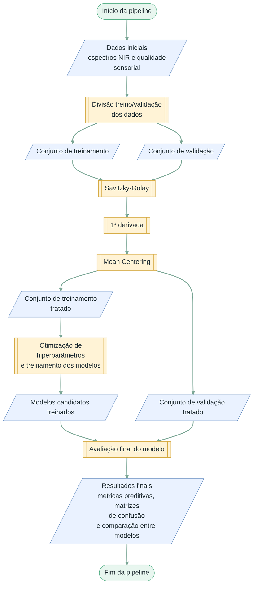
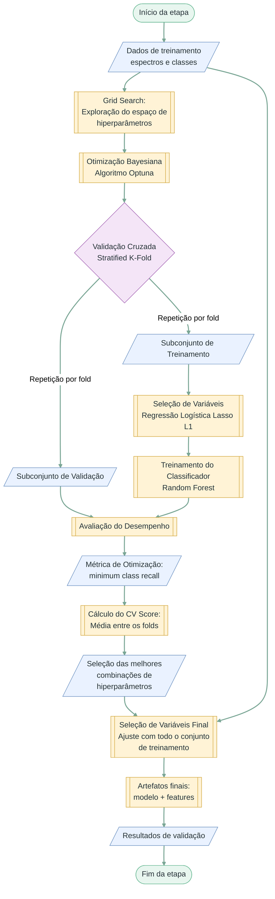

# Classificação de Cafés Especiais com NIR e Random Forest

Pipeline desenvolvida para o TCC **Classificação de Cafés Especiais da Região de Huila, Colômbia, por Espectroscopia NIR Utilizando Algoritmo Random Forest**.

O projeto classifica amostras de café torrado e moído nas classes sensoriais `muito_bom` e `excelente` a partir de espectros FT-NIR. A implementação reúne divisão representativa dos dados, pré-processamento espectral, seleção de variáveis, otimização de Random Forest e validação em um conjunto reservado.

## Execução rápida

O projeto usa Python 3.12 e [`uv`](https://docs.astral.sh/uv/getting-started/installation/) para criar o ambiente e instalar exatamente as versões registradas em `uv.lock`.

```bash
git clone https://github.com/A-malta/coffee-nir-quality.git
cd coffee-nir-quality
uv sync --locked
```

Execute a pipeline completa a partir da raiz do repositório:

```bash
uv run --locked python main.py --spectra-file data/RawSpectra_RoastedCoffee.xlsx --quality-file data/SensoryQuality_RoastedCoffee.xlsx --recipe recipes/01.yaml
```

Uma chamada executa uma repetição completa. A configuração oficial realiza 1.000 tentativas para os espectros brutos e outras 1.000 para os pré-processados, com cinco *folds* por tentativa; portanto, o processamento pode ser demorado.

## Visão geral da pipeline



A execução é coordenada por `main.py` e percorre cinco etapas: divisão dos dados, pré-processamento, visualização, busca bayesiana e validação final.

## Estrutura do repositório

```text
.
├── data/                 # planilhas de entrada versionadas
├── docs/                 # fluxogramas Mermaid e figuras selecionadas do TCC
├── recipes/01.yaml       # configuração executável da busca
├── scripts/              # orquestração das etapas da pipeline
├── src/                  # dados, pré-processamento, modelagem e métricas
├── main.py               # ponto de entrada
├── .python-version       # versão padrão do Python usada pelo uv
├── pyproject.toml        # metadados e dependências diretas
└── uv.lock               # versões exatas resolvidas pelo uv
```

Os diretórios de dados intermediários, modelos, gráficos e métricas são criados durante a execução e permanecem fora do versionamento.

## Dados versionados

Os arquivos de entrada estão em `data/`:

| Arquivo | Conteúdo |
|---|---|
| `data/RawSpectra_RoastedCoffee.xlsx` | 192 espectros e 2.001 variáveis espectrais; aba `RawSpectra_RoastedCoffee` |
| `data/SensoryQuality_RoastedCoffee.xlsx` | Identificadores, notas e classes sensoriais; aba `Cup quality_RoastedCoffee` |

Os dados derivam dos dois arquivos de café torrado do conjunto *Fourier Transform Near Infrared (FT-NIR) spectra and sensory scores in green and roasted specialty coffee for machine learning-based quality monitoring*, versão 3, de Gentil Andres Collazos-Escobar, Ever M. Morales-Angulo, Andrés Felipe Bahamón Monje e Nelson Gutierrez Guzman ([Mendeley Data, DOI 10.17632/nz2fr76trm.3](https://doi.org/10.17632/nz2fr76trm.3)). O conjunto é distribuído sob a licença [CC BY 4.0](https://creativecommons.org/licenses/by/4.0/); consulte também o [artigo de dados associado](https://doi.org/10.1016/j.dib.2025.111609).

Para adequação à pipeline, os cabeçalhos espectrais foram consolidados, os identificadores de amostra e réplica foram combinados no formato `amostra_réplica`, os registros sensoriais foram reorganizados e a coluna `Class` foi derivada da nota: `excelente` para valores maiores ou iguais a 85 e `muito_bom` para os demais. Os valores de absorbância e as pontuações sensoriais foram preservados. Normalização de rótulos e conversão do eixo espectral ocorrem durante a execução, sem sobrescrever os XLSX versionados.

A pipeline utiliza a coluna `Class` como variável resposta. Quando o eixo espectral está em número de onda, ele é convertido para comprimento de onda, cobrindo aproximadamente 833 a 2.500 nm.

> **Nota de reprodutibilidade:** a planilha versionada contém 114 espectros `muito_bom` e 78 `excelente`. O texto e a Tabela 1 do TCC informam 111 e 81, respectivamente. A divisão e os resultados de referência correspondem aos dados versionados: 153 espectros de treinamento e 39 de validação, enquanto o texto do TCC informa 154 e 38.

## Partes principais

### 1. Divisão em treinamento e validação


O algoritmo Kennard–Stone seleciona aproximadamente 20% dos espectros de cada classe para validação. A seleção procura cobrir a variabilidade espectral da classe, enquanto as amostras restantes formam o conjunto de treinamento.

### 2. Pré-processamento e visualização


O tratamento `SG_1D+MeanCentering` aplica Savitzky-Golay com janela 15, polinômio de grau 2 e primeira derivada, seguido de centralização pela média. Treinamento e validação são processados separadamente, e as versões brutas são preservadas para comparação.

A visualização gera quatro gráficos: espectros brutos e pré-processados, coloridos por pontuação sensorial e por classe.

#### Visualizações dos espectros

As figuras complementares são exibidas aqui para permitir a comparação direta entre os dados brutos e pré-processados.

| Espectros brutos por pontuação sensorial | Espectros brutos por classe |
|:---:|:---:|
|  |  |

| Espectros pré-processados por pontuação sensorial | Espectros pré-processados por classe |
|:---:|:---:|
|  |  |

### 3. Seleção de variáveis e otimização



A regressão logística com penalização L1 seleciona os comprimentos de onda dentro de cada *fold*. Em seguida, o Random Forest é avaliado por validação cruzada estratificada, usando como objetivo o menor *recall* entre as classes. Uma execução materializa os folds uma única vez e os reutiliza em todas as tentativas, tanto nos espectros brutos quanto em `SG_1D+MeanCentering`, permitindo comparar os `cv_score` sob as mesmas partições.

O Grid Search mostrado no fluxograma foi uma etapa preliminar do TCC. Ele não é reexecutado por `main.py`, pois o texto informa apenas os limites e não os valores discretos da grade. A execução principal utiliza Optuna com o amostrador TPE nos intervalos refinados.

### 4. Validação final

As dez melhores combinações da busca conjunta são reajustadas com todo o conjunto de treinamento. Os quatro modelos com maior `cv_score` são aplicados ao conjunto reservado correspondente à sua versão espectral.

São calculadas acurácia, precisão, *recall*, especificidade e métricas balanceadas, globalmente e por classe. As matrizes de confusão são normalizadas pela classe real.

## Recipe do TCC

O repositório mantém uma única configuração executável: [`recipes/01.yaml`](recipes/01.yaml).

| Parâmetro | Configuração |
|---|---|
| Tentativas | 1.000 para cada versão espectral |
| Validação cruzada | 5 folds, estratificada e embaralhada |
| Função objetivo | maximizar `min_class_recall` |
| `n_estimators` | 350–450, passo 50 |
| `max_depth` | 14–15, passo 1 |
| `min_samples_split` | 10–19, passo 1 |
| `min_samples_leaf` | 1–2, passo 1 |
| `max_features` | 0,20–0,35, uniforme |
| `bootstrap` | `true` ou `false` |
| Modelos finais | 10 |
| Modelos na validação reservada | 4, selecionados por `cv_score` |

## Ambiente e dependências

[`pyproject.toml`](pyproject.toml) é a fonte das dependências diretas e [`uv.lock`](uv.lock) fixa toda a resolução para instalações reproduzíveis. O arquivo [`.python-version`](.python-version) orienta o `uv` a usar Python 3.12; não é necessário criar ou ativar um ambiente virtual manualmente.

Para conferir se o lock está atualizado e sincronizar o ambiente:

```bash
uv lock --check
uv sync --locked
```

O protocolo experimental do TCC utilizou cinco execuções sem *seed*. Caso queira repetir esse protocolo, preserve as saídas de cada execução antes de iniciar a seguinte, pois os mesmos caminhos são reutilizados.

## Saídas de uma execução

| Caminho | Conteúdo |
|---|---|
| `data/raw_split/` | Planilhas com as matrizes espectrais e os rótulos sensoriais dos conjuntos de treinamento e validação externa |
| `data/processed/` | Matrizes espectrais após filtragem Savitzky–Golay de primeira derivada e centralização pela média, separadas por partição |
| `data/lasso_features_*.xlsx` | Indicadores binários das variáveis espectrais selecionadas por regressão logística com regularização L1, ajustada no conjunto completo de treinamento para cada representação espectral |
| `plots/` | Visualizações dos espectros brutos e pré-processados, com codificação por pontuação sensorial e por classe |
| `models/` | Dez artefatos, compostos pelo seletor de variáveis L1 e pelo classificador Random Forest |
| `resultados_bayesian_search_treinamento.csv` | Ranking dos modelos candidatos por `cv_score`, com hiperparâmetros, número de variáveis selecionadas e métricas de ajuste no treinamento |
| `resultados_validacao_final.csv` | Métricas preditivas dos quatro modelos selecionados por validação cruzada e avaliados no conjunto de validação externa, incluindo `cv_rank`, `cv_score` e ranking final |
| `confusion_matrices/` | Matrizes de confusão normalizadas por classe real para os quatro modelos avaliados na validação externa |

## Resultado de referência

O README apresenta apenas um resumo do resultado reportado no TCC. Os CSVs, planilhas de seleção e modelos das cinco execuções históricas não são versionados; cada pessoa gera seus próprios artefatos ao executar a pipeline.

O melhor modelo apresentado no trabalho foi obtido na segunda repetição e alcançou:

| Acurácia | Precisão | Recall | Especificidade | Balanced accuracy |
|---:|---:|---:|---:|---:|
| 0,769 | 0,772 | 0,769 | 0,766 | 0,766 |


Como a busca, o LASSO e o Random Forest são executados sem *seed*, novas execuções podem produzir métricas e seleções de variáveis diferentes desse valor de referência.

## Fluxogramas em arquivos separados

Os fluxogramas exibidos neste README também estão disponíveis isoladamente:

- [pipeline geral](docs/00_pipeline_geral.md);
- [divisão dos dados](docs/01_divisao_dados.md);
- [pré-processamento](docs/02_preprocessamento.md);
- [otimização e validação cruzada](docs/04_grid_search.md).
