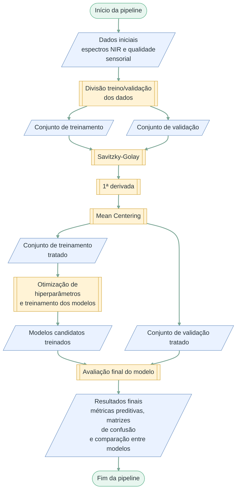

```mermaid
---
config:
  theme: neutral
  look: classic
  flowchart:
    curve: basis
    nodeSpacing: 32
    rankSpacing: 36
---
flowchart TD
    A([Início da pipeline]) --> B[/Dados iniciais<br/>espectros NIR e qualidade<br/>sensorial/]
    B --> C[[Divisão treino/validação<br/>dos dados]]

    C --> D[/Conjunto de treinamento/]
    C --> E[/Conjunto de validação/]

    D --> F[[Savitzky-Golay]]
    E --> F
    F --> G[[1ª derivada]]
    G --> H[[Mean Centering]]

    H --> I[/Conjunto de treinamento<br/>tratado/]
    H --> J[/Conjunto de validação tratado/]

    I --> K[[Otimização de<br/>hiperparâmetros<br/>e treinamento dos modelos]]
    K --> L[/Modelos candidatos treinados/]

    L --> M[[Avaliação final do modelo]]
    J --> M
    M --> N[/Resultados finais<br/>métricas preditivas, matrizes<br/>de confusão<br/>e comparação entre modelos/]
    N --> O([Fim da pipeline])

    classDef terminador fill:#E8F6EF,stroke:#62B58F,color:#263238
    classDef dados fill:#EAF2FF,stroke:#6C91C2,color:#263238
    classDef processo fill:#FFF3D6,stroke:#D4A83F,color:#263238

    class A,O terminador
    class B,D,E,I,J,L,N dados
    class C,F,G,H,K,M processo

    linkStyle default stroke:#7AA695,stroke-width:2px
```
