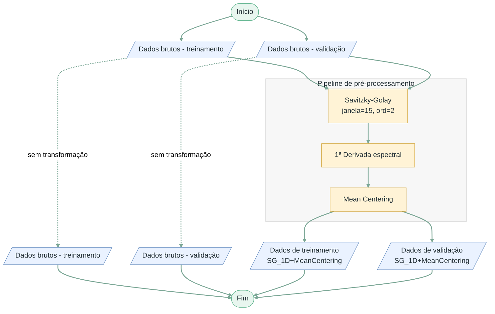

```mermaid
---
config:
  theme: neutral
  look: classic
  flowchart:
    curve: basis
    nodeSpacing: 42
    rankSpacing: 47
---
flowchart TB
    subgraph PIPE["Pipeline de pré-processamento"]
        direction TB
        SG[Savitzky-Golay<br/>janela=15, ord=2]
        D1[1ª Derivada espectral]
        MC[Mean Centering]

        SG --> D1
        D1 --> MC
    end

    A([Início]) --> B[/Dados brutos - treinamento/]
    A --> C[/Dados brutos - validação/]

    B --> SG
    C --> SG

    B -. sem transformação .-> D[/Dados brutos - treinamento/]
    C -. sem transformação .-> E[/Dados brutos - validação/]

    MC --> F[/Dados de treinamento<br/>SG_1D+MeanCentering/]
    MC --> G[/Dados de validação<br/>SG_1D+MeanCentering/]

    D --> H([Fim])
    E --> H
    F --> H
    G --> H

    classDef terminador fill:#E8F6EF,stroke:#62B58F,color:#263238
    classDef dados fill:#EAF2FF,stroke:#6C91C2,color:#263238
    classDef processo fill:#FFF3D6,stroke:#D4A83F,color:#263238

    class A,H terminador
    class B,C,D,E,F,G dados
    class SG,D1,MC processo

    style PIPE fill:#F7F7F7,stroke:#D6D6D6,color:#263238
    linkStyle default stroke:#7AA695,stroke-width:2px
```
