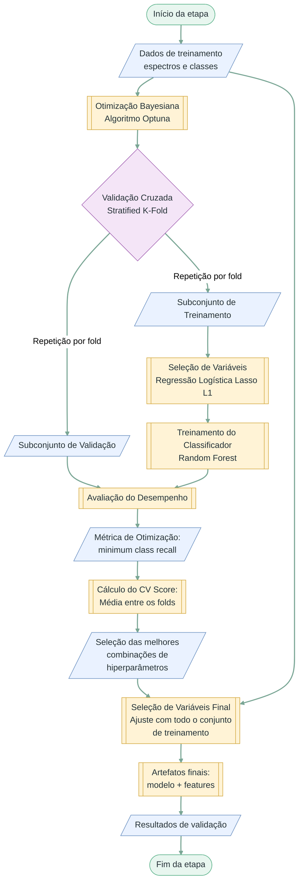

```mermaid
---
config:
  theme: neutral
  look: classic
  flowchart:
    curve: basis
    nodeSpacing: 32
    rankSpacing: 36
---
flowchart TD
    A([Início da etapa]) --> B[/Dados de treinamento<br/>espectros e classes/]
    B --> D[[Otimização Bayesiana<br/>Algoritmo Optuna]]
    D --> E{Validação Cruzada<br/>Stratified K-Fold}

    E -- "Repetição por fold" --> F[/Subconjunto de Validação/]
    E -- "Repetição por fold" --> G[/Subconjunto de Treinamento/]

    G --> H[[Seleção de Variáveis<br/>Regressão Logística Lasso L1]]
    H --> I[[Treinamento do Classificador<br/>Random Forest]]

    F --> J[[Avaliação do Desempenho]]
    I --> J

    J --> K[/Métrica de Otimização:<br/>minimum class recall/]
    K --> L[[Cálculo do CV Score:<br/>Média entre os folds]]
    L --> M[/Seleção das melhores<br/>combinações de<br/>hiperparâmetros/]

    M --> N[[Seleção de Variáveis Final<br/>Ajuste com todo o conjunto<br/>de treinamento]]
    B --> N
    N --> O[[Artefatos finais:<br/>modelo + features]]
    O --> P[/Resultados de validação/]
    P --> Q([Fim da etapa])

    classDef terminador fill:#E8F6EF,stroke:#62B58F,color:#263238
    classDef dados fill:#EAF2FF,stroke:#6C91C2,color:#263238
    classDef processo fill:#FFF3D6,stroke:#D4A83F,color:#263238
    classDef decisao fill:#F4E5F7,stroke:#A363B3,color:#263238

    class A,Q terminador
    class B,F,G,K,M,P dados
    class D,H,I,J,L,N,O processo
    class E decisao

    linkStyle default stroke:#7AA695,stroke-width:2px
```
