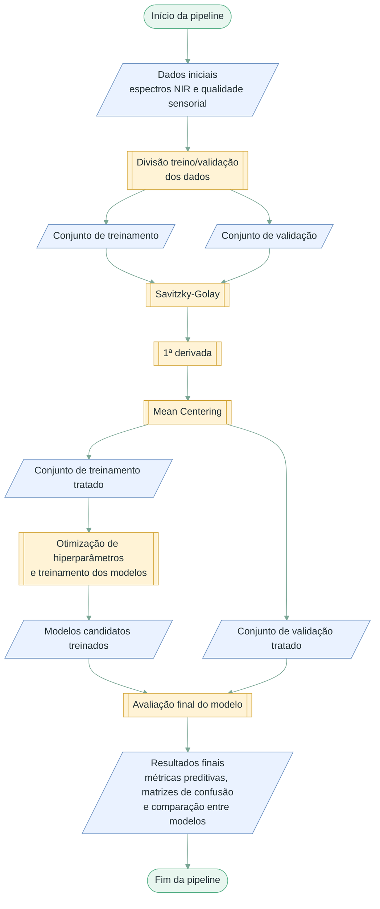

# Fluxograma 00 - Pipeline geral

Visão metodológica integrada da pipeline de classificação da qualidade sensorial de café torrado a partir de espectros NIR.

## Convenção visual

- Terminador: início ou fim do processo.
- Paralelogramo: entrada ou saída de dados/resultados.
- Retângulo: processo, transformação ou análise.
- Losango: decisão, repetição ou seleção.

## Etapas detalhadas

- [01 - Divisão treino/validação](01_divisao_dados.md): Separação estratificada utilizando o algoritmo Kennard-Stone para garantir representatividade espectral.
- [02 - Pré-processamento espectral](02_preprocessamento.md): Pré-tratamento sequencial dos sinais por Savitzky-Golay, 1ª derivada e Mean Centering, aplicado de forma independente para evitar vazamento de dados.
- [03 - Visualização dos espectros](03_visualizacao_espectros.md): Análise exploratória e gráfica dos perfis espectrais antes e após o tratamento.
- [04 - Otimização e treinamento](04_grid_search.md): Busca exaustiva (Grid Search) pelos melhores hiperparâmetros do classificador Random Forest.
- [05 - Avaliação final do modelo](05_validacao_final.md): Avaliação do poder preditivo dos modelos em um conjunto de dados estritamente não visto durante o treinamento.
