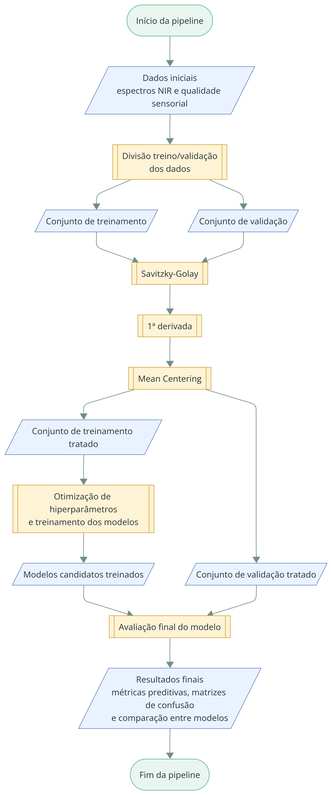

# Figura 3 - Pipeline metodológica geral

Reprodução da Figura 3 do TCC (página 27), preservando o conteúdo visual original.

**Figura 3 – Esquema geral da pipeline metodológica utilizada para classificação de cafés especiais a partir de espectros NIR.**

Fonte: Elaborado pela autora.

## Descrição metodológica

A pipeline foi implementada em Python e executada de forma contínua. O trabalho descreve cinco etapas principais:

1. carregamento e divisão dos dados;
2. pré-processamento espectral;
3. visualização exploratória;
4. treinamento com seleção de variáveis e busca bayesiana de hiperparâmetros;
5. validação final.

A esteira foi executada cinco vezes, sem definição de *seed* para reprodutibilidade.

## Etapas detalhadas

- [01 - Divisão em treinamento e validação](01_divisao_dados.md)
- [02 - Pré-processamento espectral](02_preprocessamento.md)
- [03 - Visualização dos espectros](03_visualizacao_espectros.md)
- [04 - Seleção de variáveis, treinamento e busca de hiperparâmetros](04_grid_search.md)
- [05 - Validação final](05_validacao_final.md)

> Nota de fidelidade: a visualização exploratória é descrita como uma das cinco etapas no texto, embora não apareça como um bloco independente na Figura 3.
