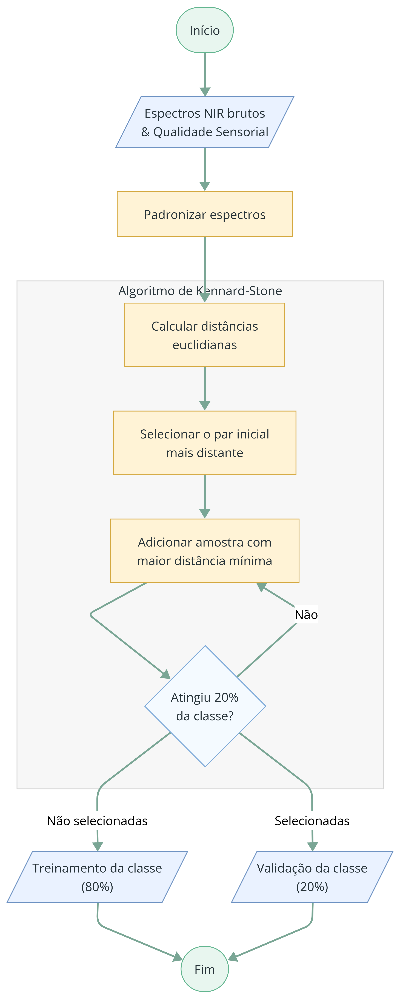

# Figura 4 - Divisão em treinamento e validação

Reprodução da Figura 4 do TCC (página 29), preservando o conteúdo visual original.

**Figura 4 – Esquema de separação dos conjuntos de teste e validação dos dados.**

Fonte: Elaborado pela autora.

> Nota de fidelidade: a legenda original usa a expressão “conjuntos de teste e validação”. O corpo do TCC e o próprio fluxograma usam “treinamento” e “validação”.

## Procedimento descrito no TCC

1. Os espectros foram padronizados para que as variáveis apresentassem a mesma escala.
2. O algoritmo Kennard–Stone foi aplicado separadamente às classes *muito bom* e *excelente*.
3. Dentro de cada classe, 20% dos espectros foram destinados à validação.
4. As amostras remanescentes formaram o conjunto de treinamento.

## Distribuição das amostras

| Classe | Total | Treinamento | Validação |
|---|---:|---:|---:|
| Muito Bom | 111 | 89 | 22 |
| Excelente | 81 | 65 | 16 |
| **Total** | **192** | **154** | **38** |

Fonte: Tabela 1 do TCC, página 28.
