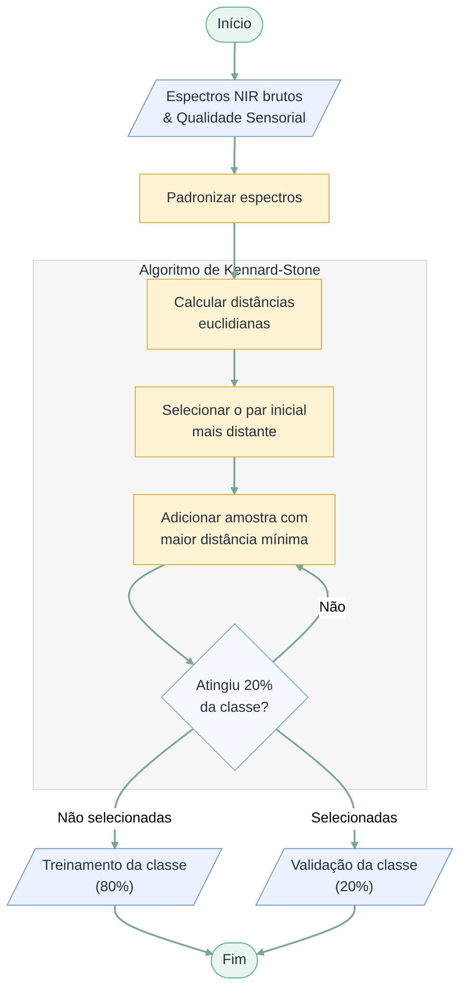

# Fluxograma 01 - Divisão treino/validação

Fluxograma metodológico da etapa de separação dos dados experimentais em conjuntos de treinamento e validação. O procedimento representado corresponde à seleção dentro de uma classe e foi aplicado separadamente às duas classes sensoriais.

## Convenção visual

- Terminador: início ou fim do processo.
- Paralelogramo: entrada ou saída de dados/resultados.
- Retângulo: processo, transformação ou análise.
- Losango: decisão, repetição ou seleção.

## Entradas

- Espectros NIR brutos.
- Tabela de qualidade sensorial das amostras.

## Saídas

- Conjunto de treinamento com espectros e classes.
- Conjunto de validação com espectros e classes, criado nesta etapa e mantido fora do treinamento.
- Separação representativa da variabilidade espectral dentro de cada classe, aplicada separadamente às duas classes sensoriais.
