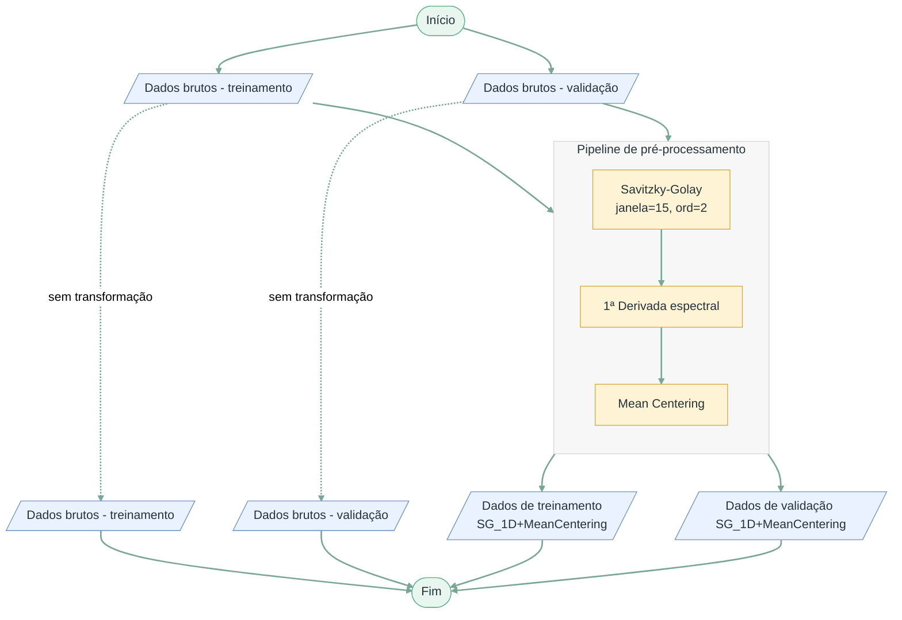

# Fluxograma 02 - Pré-processamento espectral

Fluxograma metodológico da etapa de tratamento dos espectros NIR antes da modelagem.

## Convenção visual

- Terminador: início ou fim do processo.
- Paralelogramo: entrada ou saída de dados/resultados.
- Retângulo: processo, transformação ou análise.
- Losango: decisão, repetição ou seleção.

## Entradas

- Espectros NIR do conjunto de treinamento.
- Espectros NIR do conjunto de validação.

## Saídas

- Matriz espectral de treinamento pré-processada.
- Matriz espectral de validação pré-processada, mantida fora do ajuste dos modelos.
- Sinais preparados para modelagem multivariada.
