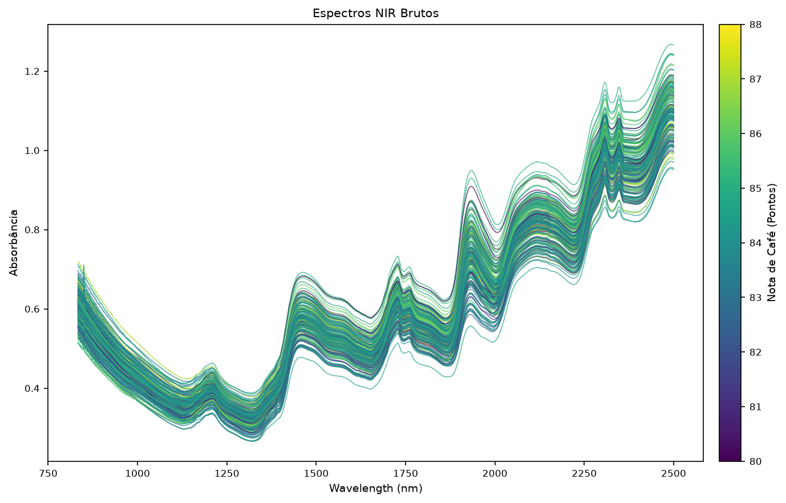
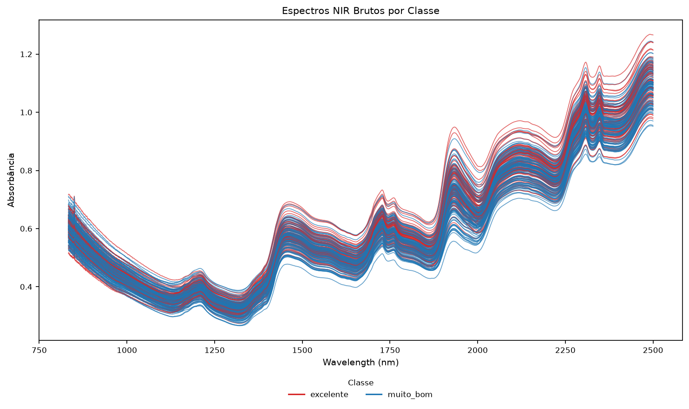
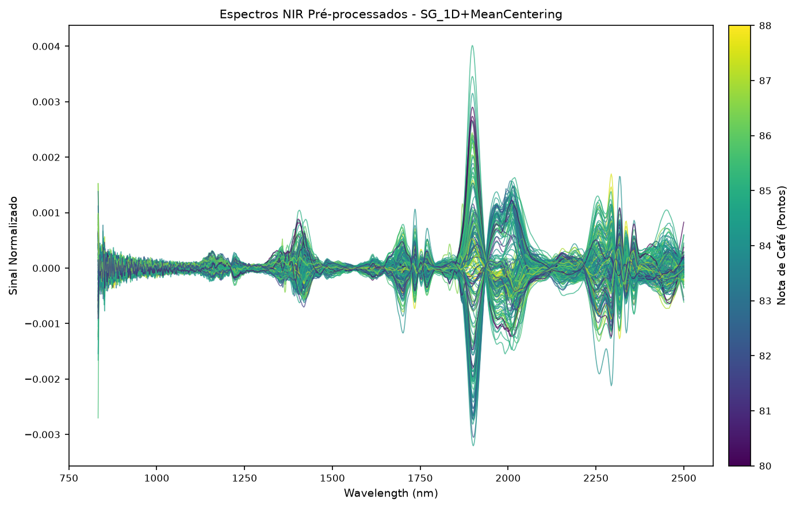
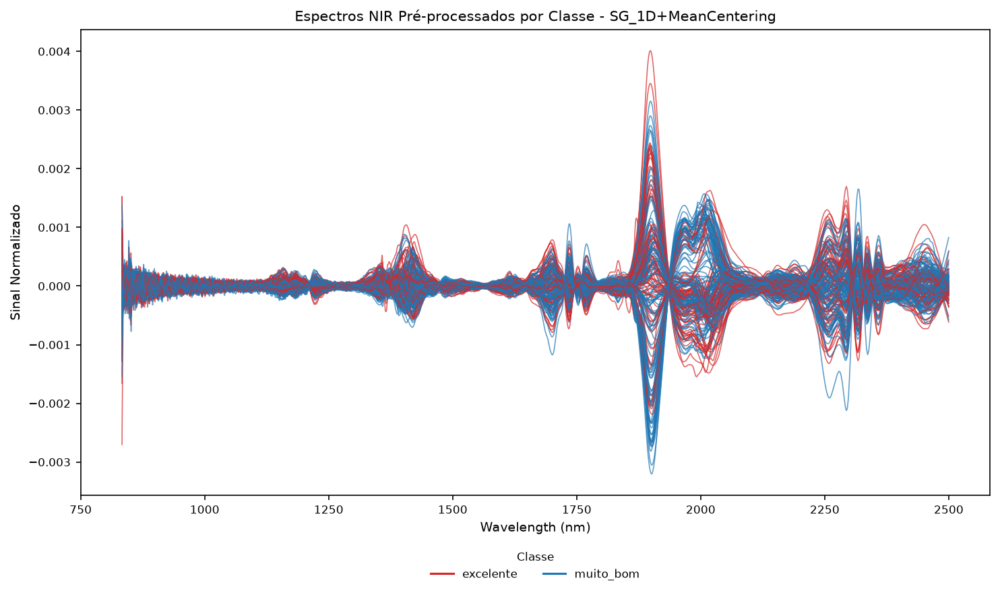

# Figuras 6 a 9 - Visualização dos espectros

O TCC não apresenta um fluxograma específico para esta etapa. A Seção 4.4 é representada pelas Figuras 6 a 9, reproduzidas abaixo a partir dos elementos visuais originais do PDF.

## Espectros brutos por pontuação sensorial

**Figura 6 – Espectros NIR brutos de café torrado por pontuação sensorial.**

## Espectros brutos por classe sensorial

**Figura 7 – Espectros NIR brutos de café torrado agrupados por classe sensorial.**

## Espectros pré-processados por pontuação sensorial

**Figura 8 – Espectros NIR pré-processados por Savitzky-Golay, primeira derivada e mean centering.**

## Espectros pré-processados por classe sensorial

**Figura 9 – Espectros NIR pré-processados por Savitzky-Golay, primeira derivada e mean centering, agrupados por classe sensorial.**

Fonte: Elaborado pela autora.

## Procedimento descrito no TCC

- As curvas brutas e pré-processadas foram inicialmente coloridas pela pontuação sensorial.
- Em seguida, os espectros foram organizados segundo as classes *muito bom* e *excelente*.
- A inspeção visual foi usada para caracterizar a variabilidade espectral e observar o efeito do pré-processamento.
- Não foi observada separação visual evidente entre as classes sensoriais.
