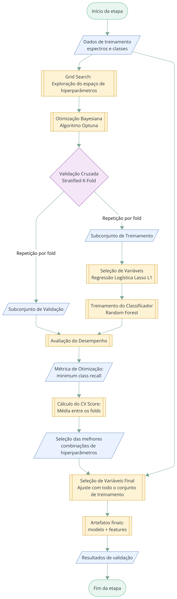

# Figura 10 - Seleção de variáveis, treinamento e busca de hiperparâmetros

Reprodução da Figura 10 do TCC (página 34), preservando o conteúdo visual original.

**Figura 10 – Esquema da seleção de variáveis por LASSO e busca de hiperparâmetros.**

Fonte: Elaborado pela autora.

## Procedimento descrito no TCC

1. A seleção de variáveis foi realizada por regressão logística com penalização L1 (Lasso), usando o *solver* `saga`.
2. A importância de cada comprimento de onda foi obtida pelo valor absoluto do coeficiente, mantendo-se as variáveis acima do limiar definido.
3. O classificador utilizado foi o Random Forest.
4. Antes da otimização bayesiana, uma busca em grade explorou um espaço amplo de hiperparâmetros.
5. A otimização bayesiana foi realizada com Optuna e o algoritmo Tree-structured Parzen Estimator (TPE).
6. Cada combinação foi avaliada por validação cruzada estratificada (*Stratified K-Fold*), usando como função objetivo o *minimum class recall*.
7. A seleção de variáveis e o Random Forest foram ajustados novamente dentro de cada *fold*, apenas com o subconjunto de treinamento correspondente.
8. O *cross-validation score* foi calculado pela média do *minimum class recall* entre os *folds*.
9. As 10 melhores combinações foram usadas para treinar os modelos finais; a seleção de variáveis foi então reajustada com todo o conjunto de treinamento.

## Tabela 2 - Intervalos avaliados no Grid Search

| Hiperparâmetro | Símbolo | Intervalo avaliado |
|---|---|---:|
| Número de árvores | `n_estimators` | 300–1000 |
| Profundidade máxima | `max_depth` | 6–20 |
| Mínimo de amostras para divisão | `min_samples_split` | 2–20 |
| Mínimo de amostras por folha | `min_samples_leaf` | 1–10 |
| Fração de atributos | `max_features` | 0,001–1 |
| Bootstrap | `bootstrap` | True, False |

Fonte: Tabela 2 do TCC, página 35.

## Tabela 3 - Intervalos usados na Otimização Bayesiana

| Hiperparâmetro | Símbolo | Intervalo avaliado |
|---|---|---:|
| Número de árvores | `n_estimators` | 350–450 (passo = 50) |
| Profundidade máxima | `max_depth` | 14–15 (passo = 1) |
| Mínimo de amostras para divisão | `min_samples_split` | 10–19 (passo = 1) |
| Mínimo de amostras por folha | `min_samples_leaf` | 1–2 (passo = 1) |
| Fração de atributos | `max_features` | 0,20–0,35 |
| Bootstrap | `bootstrap` | True, False |

Fonte: Tabela 3 do TCC, página 35.

> Nota de fidelidade: o PDF não informa o número de tentativas do Optuna, a quantidade de *folds*, o valor do limiar do Lasso, `C`, `max_iter` ou `tol`. Por isso, esses valores não são apresentados aqui como parte do texto do TCC.
