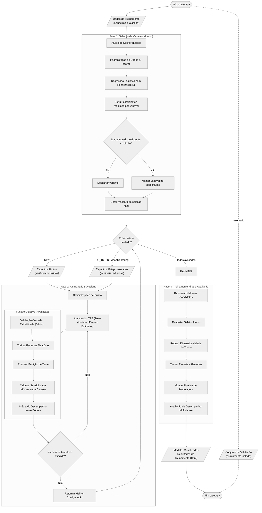

# Fluxograma 04 - Otimização e treinamento dos modelos

Fluxograma detalhado da etapa de seleção de variáveis, otimização bayeseana de hiperparâmetros e treinamento final do pipeline, utilizando terminologia teórica.

## Convenção visual

- Terminador: início ou fim do processo.
- Paralelogramo: entrada ou saída de dados/resultados.
- Retângulo: processo, transformação ou análise.
- Losango: decisão, repetição ou seleção.

## Espaço de busca (Otimização Bayesiana)

| Hiperparâmetro       | Espaço de busca (Range)    | Distribuição       | Papel no modelo                              |
|----------------------|----------------------------|--------------------|----------------------------------------------|
| `n_estimators`       | 300 - 700                  | Discreta (passo 50)| Número de árvores no ensemble                |
| `max_depth`          | 8 - 15                     | Discreta (passo 1) | Profundidade máxima de cada árvore           |
| `min_samples_split`  | 8 - 20                     | Discreta (passo 1) | Mínimo de amostras para dividir um nó        |
| `min_samples_leaf`   | 1 - 8                      | Discreta (passo 1) | Mínimo de amostras em uma folha              |
| `max_features`       | 0.1 - 0.6                  | Contínua Uniforme  | Fração de variáveis avaliadas em cada divisão|
| `bootstrap`          | [True, False]              | Categórica         | Amostragem com reposição entre árvores       |

## Detalhes Teóricos da Implementação

### Seleção de Variáveis (Lasso)
- **Padronização**: A aplicação do Z-score garante que todas as bandas espectrais estejam na mesma escala, permitindo que a penalização L1 identifique corretamente as variáveis mais informativas.
- **Penalização L1**: Utilizada para induzir esparsidade no modelo, forçando coeficientes de variáveis irrelevantes a zero.
- **Limiar de Seleção**: Um limiar de `1e-8` é aplicado para garantir a exclusão de variáveis com impacto estatisticamente insignificante.

### Métrica de Otimização: Sensibilidade Mínima entre Classes
Esta métrica prioriza a classe com o menor desempenho individual (Recall), garantindo que o modelo não negligencie categorias minoritárias ou de difícil detecção, promovendo a equidade no desempenho preditivo.

### Pipeline de Modelagem
O modelo final é estruturado como um fluxo sequencial que encapsula a seleção de variáveis e a classificação. Isso assegura que qualquer dado novo seja submetido à mesma transformação dimensional antes da inferência, mantendo a integridade estatística do processo.

## Entradas e Saídas
- **Entradas**: Configurações de busca e conjuntos de dados espectrais.
- **Saídas**: Melhores modelos candidatos e relatório de métricas de treinamento.

