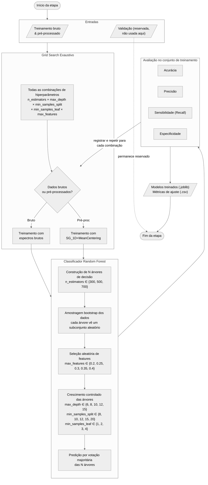

# Fluxograma 04 - Otimização e treinamento dos modelos

Fluxograma metodológico da etapa de busca exaustiva de hiperparâmetros e treinamento supervisionado com Random Forest.

## Convenção visual

- Terminador: início ou fim do processo.
- Paralelogramo: entrada ou saída de dados/resultados.
- Retângulo: processo, transformação ou análise.
- Losando: decisão, repetição ou seleção.

## Espaço de hiperparâmetros

| Hiperparâmetro       | Valores testados              | Papel no modelo                                  |
|----------------------|-------------------------------|--------------------------------------------------|
| `n_estimators`       | 300, 500, 700                 | Número de árvores do ensemble                    |
| `max_depth`          | 6, 8, 10, 12, 15              | Profundidade máxima de cada árvore               |
| `min_samples_split`  | 8, 10, 12, 15, 20             | Mínimo de amostras para dividir um nó            |
| `min_samples_leaf`   | 1, 2, 3, 4                    | Mínimo de amostras em uma folha                  |
| `max_features`       | 0.2, 0.25, 0.3, 0.35, 0.4    | Fração de features avaliadas em cada divisão     |
| `bootstrap`          | True                          | Usa amostragem com reposição                     |

**Total de combinações**: 3 × 5 × 5 × 4 × 5 = **1500 por tipo de dado** (bruto e pré-processado), totalizando **3000 modelos treinados**.

## Entradas

- Conjuntos de treinamento bruto e pré-processado com rótulos de classe.
- Grade de hiperparâmetros definida em `recipes/random_forest_grid_search.yaml`.
- Conjunto de validação mantido estritamente reservado.

## Saídas

- Modelos candidatos treinados e serializados em `.joblib`.
- Métricas de ajuste de treinamento registradas em `.csv`.

